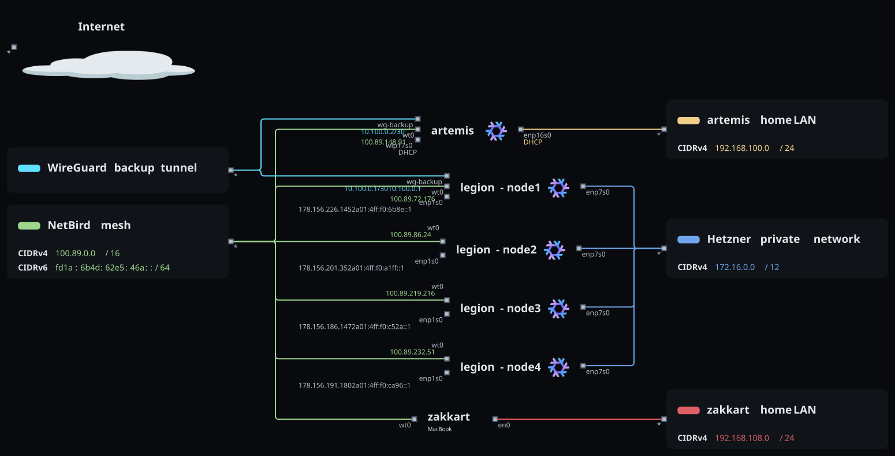

# cornn flaek

Personal Nix flake for `artemis` (headless NixOS gaming and streaming box),
`zakkart` (nix-darwin MacBook), and the `legion-node1`..`legion-node4`
Hetzner service nodes.

The networks connecting every host.

The hosts, their services, and the connections between them.

- [`AGENTS.md`](AGENTS.md): layout, operation, and the decisions that
  constrain changes.
- [`docs/runbooks/`](docs/runbooks/): restore, binary cache, wallpaper, and
  zakkart bootstrap procedures.
- [`ACKNOWLEDGEMENTS.md`](ACKNOWLEDGEMENTS.md): project name and source
  credits.
