# State machines

The fleet keeps several state machines whose state is not declared in one
place: it lives in a file's presence, a symlink, a unit's active state, an EFI
variable, or a timer stamp. Each diagram answers one question: what states can
this thing be in, and what moves it between them. The sources under each
diagram are where to check it against the code.

## artemis

### Boot counting and blessing

What decides whether a new generation stays?

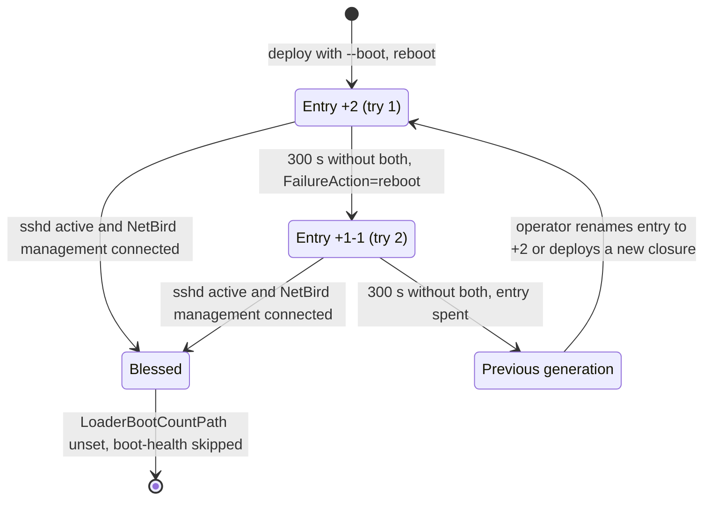
```mermaid
stateDiagram-v2
    [*] --> Try1: deploy with --boot, reboot
    state "Entry +2 (try 1)" as Try1
    state "Entry +1-1 (try 2)" as Try2
    state "Blessed" as Blessed
    state "Previous generation" as Fallback
    Try1 --> Blessed: sshd active and NetBird management connected
    Try1 --> Try2: 300 s without both, FailureAction=reboot
    Try2 --> Blessed: sshd active and NetBird management connected
    Try2 --> Fallback: 300 s without both, entry spent
    Blessed --> [*]: LoaderBootCountPath unset, boot-health skipped
    Fallback --> Try1: operator renames entry to +2 or deploys a new closure
```

Sources: `modules/hosts/artemis/boot-health.nix`, AGENTS.md "Deploying".

### Emergency watchdog

What happens when stage 2 drops to emergency mode?

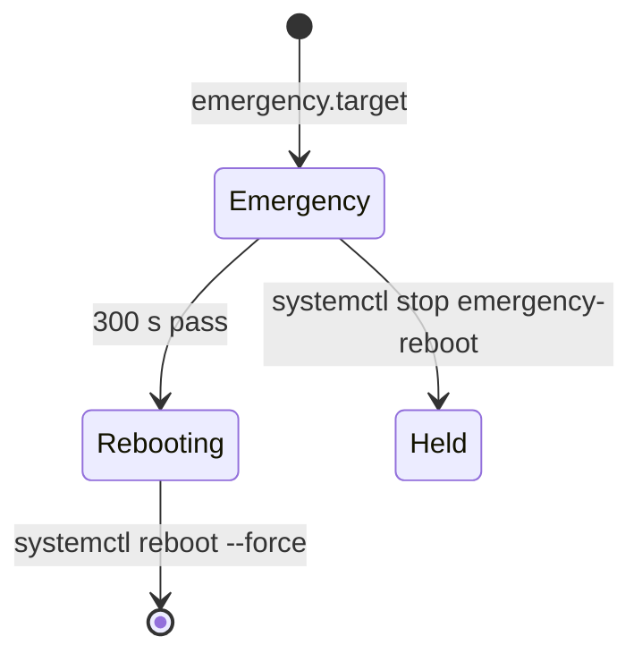
```mermaid
stateDiagram-v2
    [*] --> Emergency: emergency.target
    Emergency --> Rebooting: 300 s pass
    Emergency --> Held: systemctl stop emergency-reboot
    Rebooting --> [*]: systemctl reboot --force
```

Sources: `modules/hosts/artemis/boot-health.nix`.

### Root rollback

What happens to `/` on every boot?

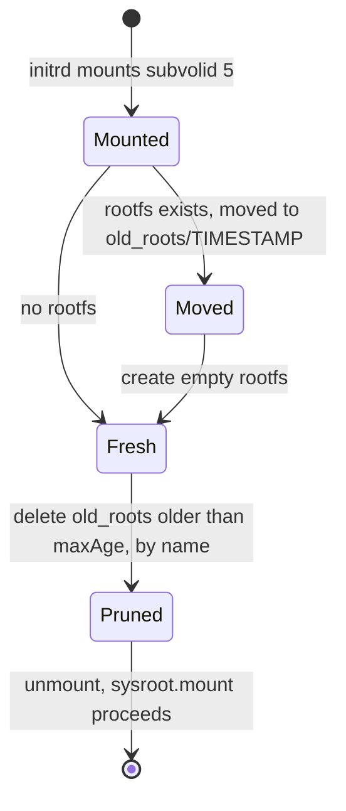
```mermaid
stateDiagram-v2
    [*] --> Mounted: initrd mounts subvolid 5
    Mounted --> Moved: rootfs exists, moved to old_roots/TIMESTAMP
    Mounted --> Fresh: no rootfs
    Moved --> Fresh: create empty rootfs
    Fresh --> Pruned: delete old_roots older than maxAge, by name
    Pruned --> [*]: unmount, sysroot.mount proceeds
```

Sources: `modules/impermanence.nix`.

### Persistence of one path

How does a path become persistent without losing its data?

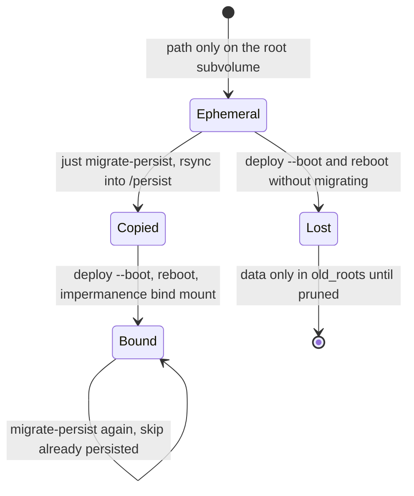
```mermaid
stateDiagram-v2
    [*] --> Ephemeral: path only on the root subvolume
    Ephemeral --> Copied: just migrate-persist, rsync into /persist
    Ephemeral --> Lost: deploy --boot and reboot without migrating
    Copied --> Bound: deploy --boot, reboot, impermanence bind mount
    Bound --> Bound: migrate-persist again, skip already persisted
    Lost --> [*]: data only in old_roots until pruned
```

Sources: `modules/impermanence.nix`, `modules/hosts/artemis/migrate-persist.sh`.

### `/persist` backup

How does a backup pause the game servers?

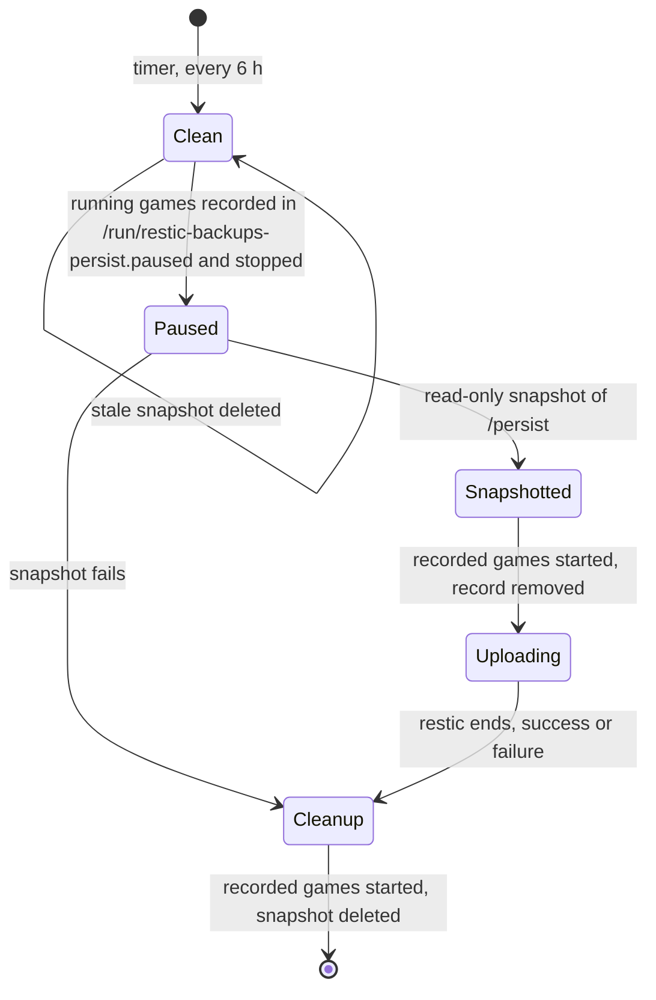
```mermaid
stateDiagram-v2
    [*] --> Clean: timer, every 6 h
    Clean --> Clean: stale snapshot deleted
    Clean --> Paused: running games recorded in /run/restic-backups-persist.paused and stopped
    Paused --> Snapshotted: read-only snapshot of /persist
    Snapshotted --> Uploading: recorded games started, record removed
    Paused --> Cleanup: snapshot fails
    Uploading --> Cleanup: restic ends, success or failure
    Cleanup --> [*]: recorded games started, snapshot deleted
```

Sources: `modules/backups/default.nix`, `modules/pause-units.nix`.

### Gamemode pause

What stops while a game runs?

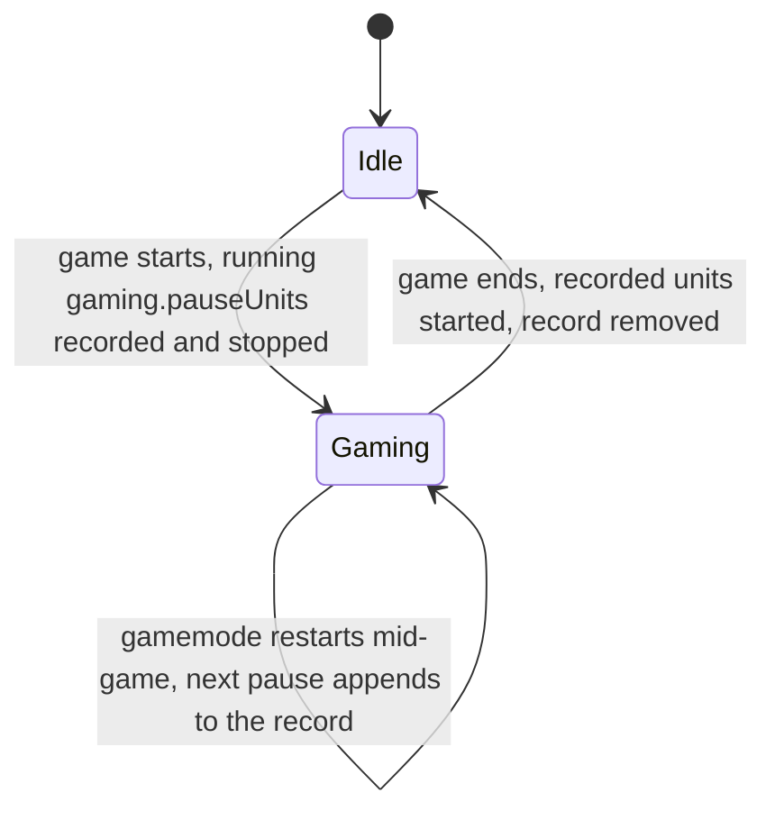
```mermaid
stateDiagram-v2
    [*] --> Idle
    Idle --> Gaming: game starts, running gaming.pauseUnits recorded and stopped
    Gaming --> Idle: game ends, recorded units started, record removed
    Gaming --> Gaming: gamemode restarts mid-game, next pause appends to the record
```

Sources: `modules/gaming.nix`, `modules/pause-units.nix`. Units: qBittorrent
(`modules/qbittorrent/default.nix`), atrium's llama units
(`modules/atrium/default.nix`), cod4e-vision (`modules/cod4e-vision.nix`).

### qBittorrent and its tunnel

What must be up for qBittorrent to run?

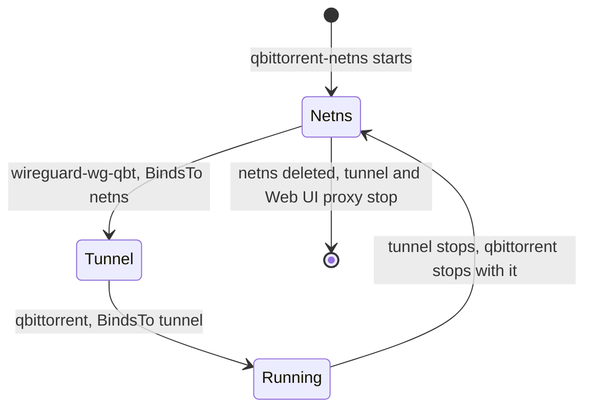
```mermaid
stateDiagram-v2
    [*] --> Netns: qbittorrent-netns starts
    Netns --> Tunnel: wireguard-wg-qbt, BindsTo netns
    Tunnel --> Running: qbittorrent, BindsTo tunnel
    Running --> Netns: tunnel stops, qbittorrent stops with it
    Netns --> [*]: netns deleted, tunnel and Web UI proxy stop
```

Sources: `modules/qbittorrent/default.nix`.

### bees window

When does bees run?

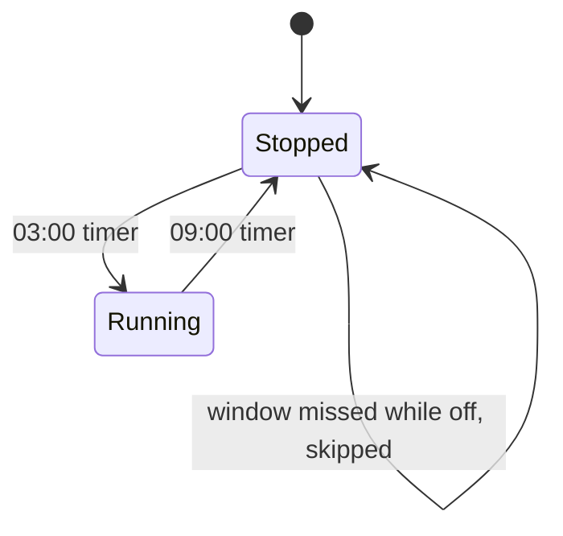
```mermaid
stateDiagram-v2
    [*] --> Stopped
    Stopped --> Running: 03:00 timer
    Running --> Stopped: 09:00 timer
    Stopped --> Stopped: window missed while off, skipped
```

Sources: `modules/hosts/artemis/disko.nix`.

### Model weights

How does a model file reach the disk?

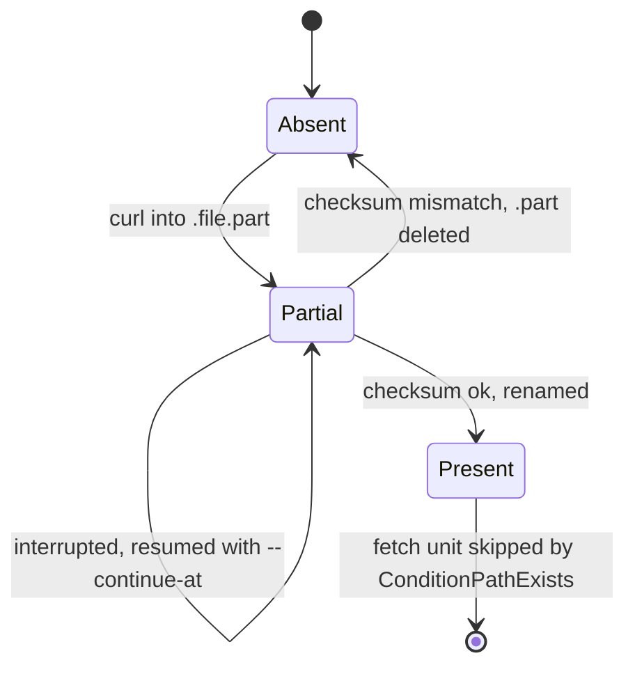
```mermaid
stateDiagram-v2
    [*] --> Absent
    Absent --> Partial: curl into .file.part
    Partial --> Partial: interrupted, resumed with --continue-at
    Partial --> Absent: checksum mismatch, .part deleted
    Partial --> Present: checksum ok, renamed
    Present --> [*]: fetch unit skipped by ConditionPathExists
```

Sources: `modules/llama-server.nix`, `modules/packages/qwen-image.nix`.

## Legion

### Volume guard

What does a stateful service do without its Volume?

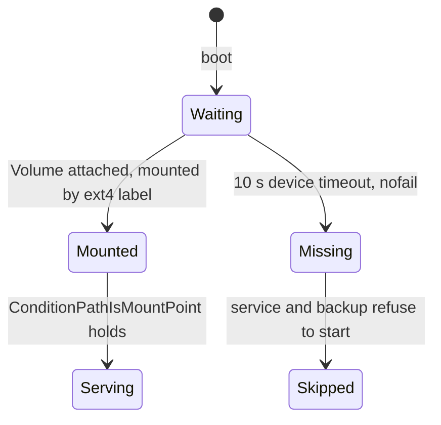
```mermaid
stateDiagram-v2
    [*] --> Waiting: boot
    Waiting --> Mounted: Volume attached, mounted by ext4 label
    Waiting --> Missing: 10 s device timeout, nofail
    Mounted --> Serving: ConditionPathIsMountPoint holds
    Missing --> Skipped: service and backup refuse to start
```

Sources: `modules/mount-guard.nix`, `modules/hosts/legion/default.nix`,
`modules/backups/default.nix`.

### Root-disk backup

How does a Legion backup pause its service?

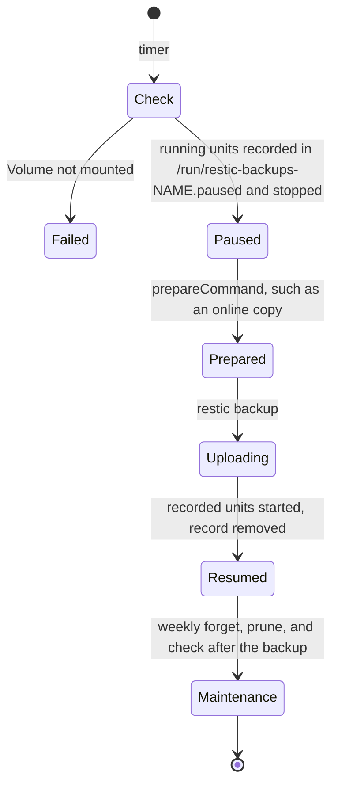
```mermaid
stateDiagram-v2
    [*] --> Check: timer
    Check --> Failed: Volume not mounted
    Check --> Paused: running units recorded in /run/restic-backups-NAME.paused and stopped
    Paused --> Prepared: prepareCommand, such as an online copy
    Prepared --> Uploading: restic backup
    Uploading --> Resumed: recorded units started, record removed
    Resumed --> Maintenance: weekly forget, prune, and check after the backup
    Maintenance --> [*]
```

Sources: `modules/backups/default.nix`, `modules/pause-units.nix`. garret
pauses nothing and backs up an online copy (`modules/garret/default.nix`).

### garret index

When may garret start?

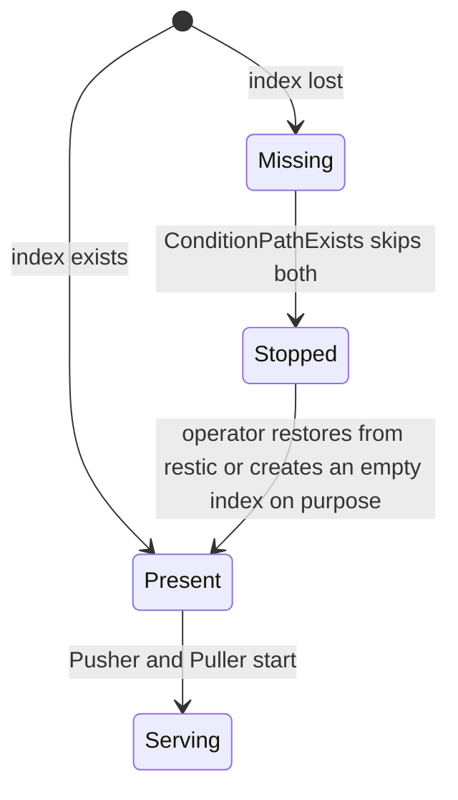
```mermaid
stateDiagram-v2
    [*] --> Present: index exists
    [*] --> Missing: index lost
    Present --> Serving: Pusher and Puller start
    Missing --> Stopped: ConditionPathExists skips both
    Stopped --> Present: operator restores from restic or creates an empty index on purpose
```

Sources: `modules/garret/default.nix`, `docs/runbooks/garret.md`.

### atuin restore

What does atuin start with?

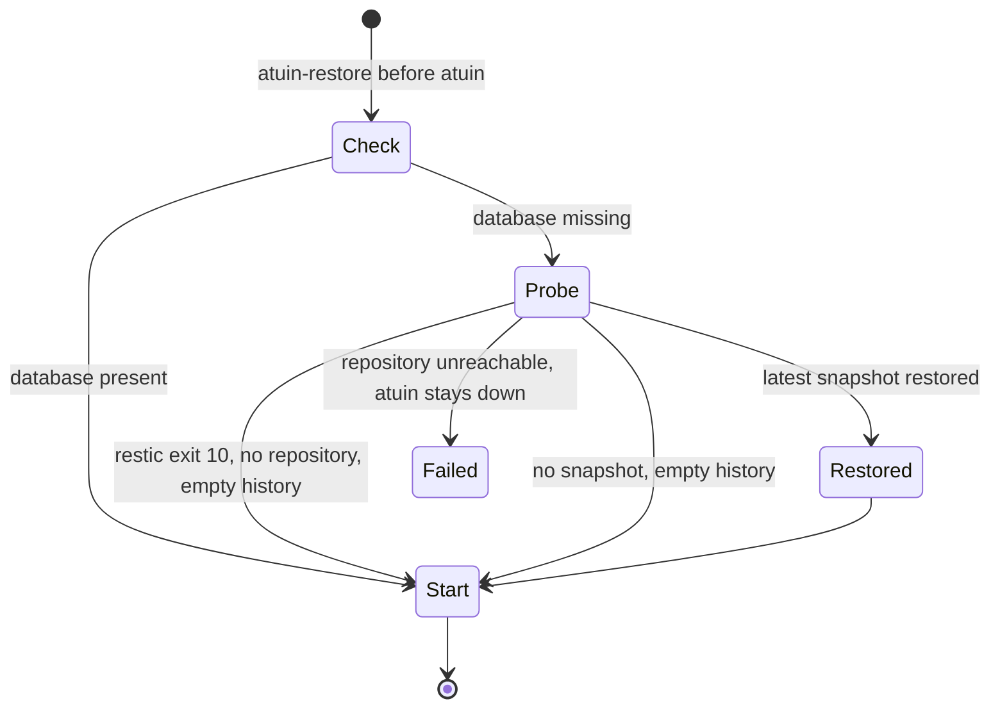
```mermaid
stateDiagram-v2
    [*] --> Check: atuin-restore before atuin
    Check --> Start: database present
    Check --> Probe: database missing
    Probe --> Start: restic exit 10, no repository, empty history
    Probe --> Failed: repository unreachable, atuin stays down
    Probe --> Start: no snapshot, empty history
    Probe --> Restored: latest snapshot restored
    Restored --> Start
    Start --> [*]
```

Sources: `modules/atuin.nix`.

### portfolio-update

When does the portfolio restart?

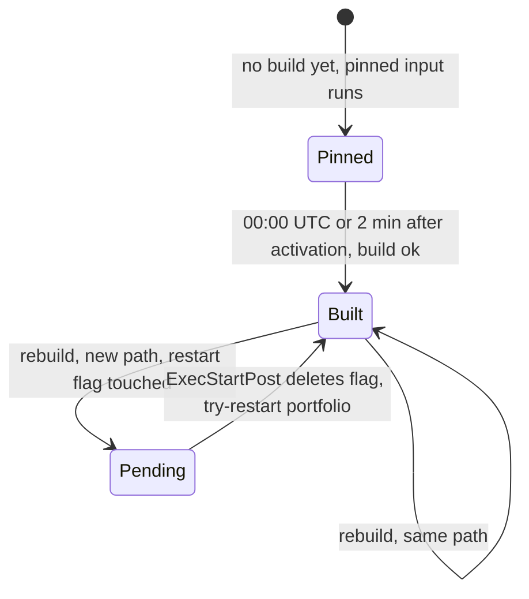
```mermaid
stateDiagram-v2
    [*] --> Pinned: no build yet, pinned input runs
    Pinned --> Built: 00:00 UTC or 2 min after activation, build ok
    Built --> Built: rebuild, same path
    Built --> Pending: rebuild, new path, restart flag touched
    Pending --> Built: ExecStartPost deletes flag, try-restart portfolio
```

Sources: `modules/portfolio/default.nix`.

### rivals hero snapshot

What does Caddy serve for the rivals hero data?

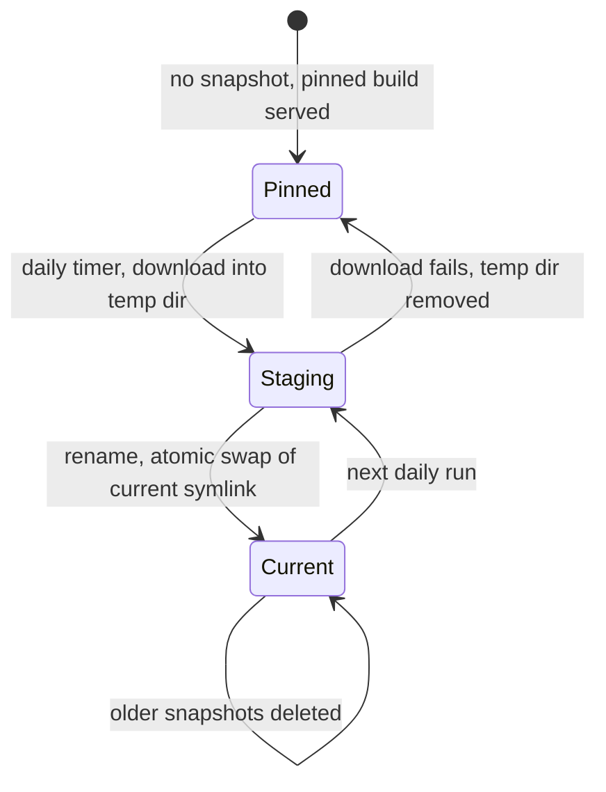
```mermaid
stateDiagram-v2
    [*] --> Pinned: no snapshot, pinned build served
    Pinned --> Staging: daily timer, download into temp dir
    Staging --> Pinned: download fails, temp dir removed
    Staging --> Current: rename, atomic swap of current symlink
    Current --> Staging: next daily run
    Current --> Current: older snapshots deleted
```

Sources: `modules/edge/default.nix`.

### CrowdSec bouncer key

When is a bouncer key registered again?

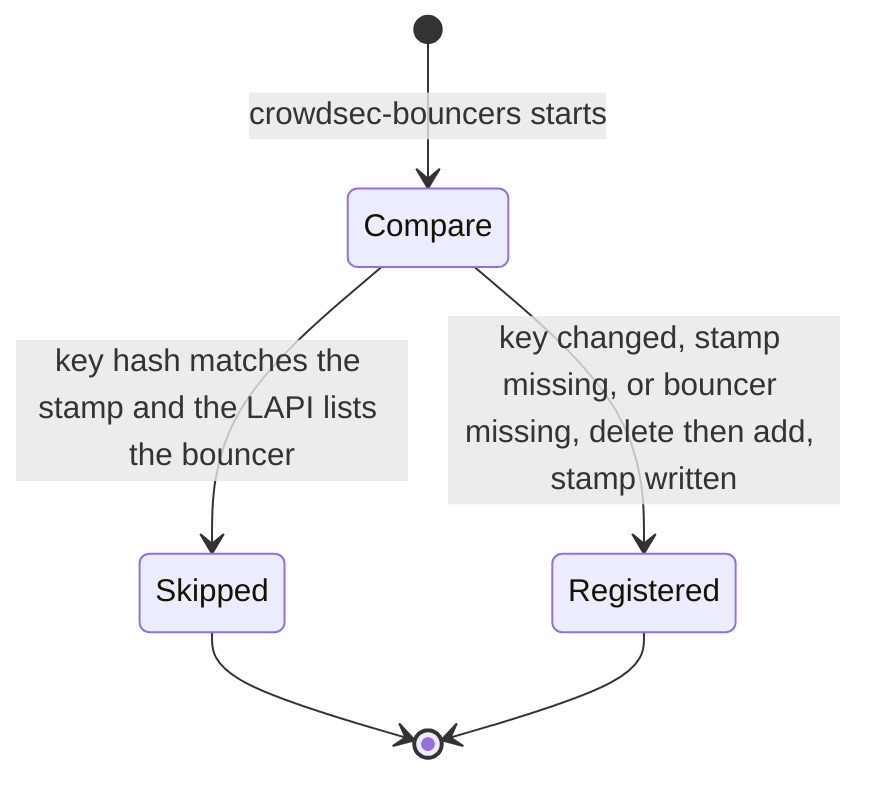
```mermaid
stateDiagram-v2
    [*] --> Compare: crowdsec-bouncers starts
    Compare --> Skipped: key hash matches the stamp and the LAPI lists the bouncer
    Compare --> Registered: key changed, stamp missing, or bouncer missing, delete then add, stamp written
    Skipped --> [*]
    Registered --> [*]
```

Sources: `modules/crowdsec/default.nix`.

### Mesh peer address

When can Legion machines reach a non-Hetzner node?

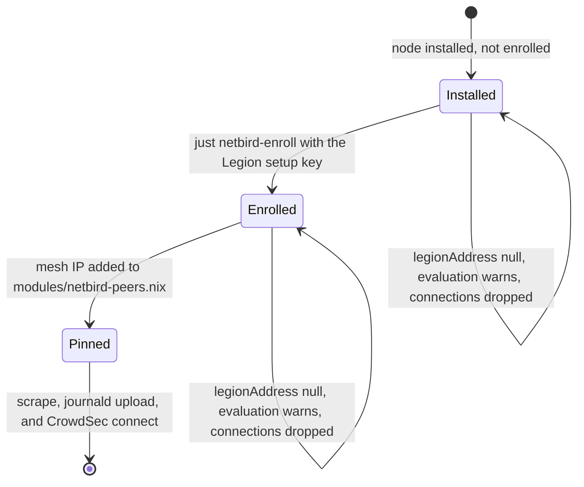
```mermaid
stateDiagram-v2
    [*] --> Installed: node installed, not enrolled
    Installed --> Enrolled: just netbird-enroll with the Legion setup key
    Enrolled --> Pinned: mesh IP added to modules/netbird-peers.nix
    Installed --> Installed: legionAddress null, evaluation warns, connections dropped
    Enrolled --> Enrolled: legionAddress null, evaluation warns, connections dropped
    Pinned --> [*]: scrape, journald upload, and CrowdSec connect
```

Sources: `modules/hosts/legion/default.nix`, `modules/netbird-peers.nix`.

## Fleet and tooling

### deploy-rs magic rollback

Does a live switch stay?

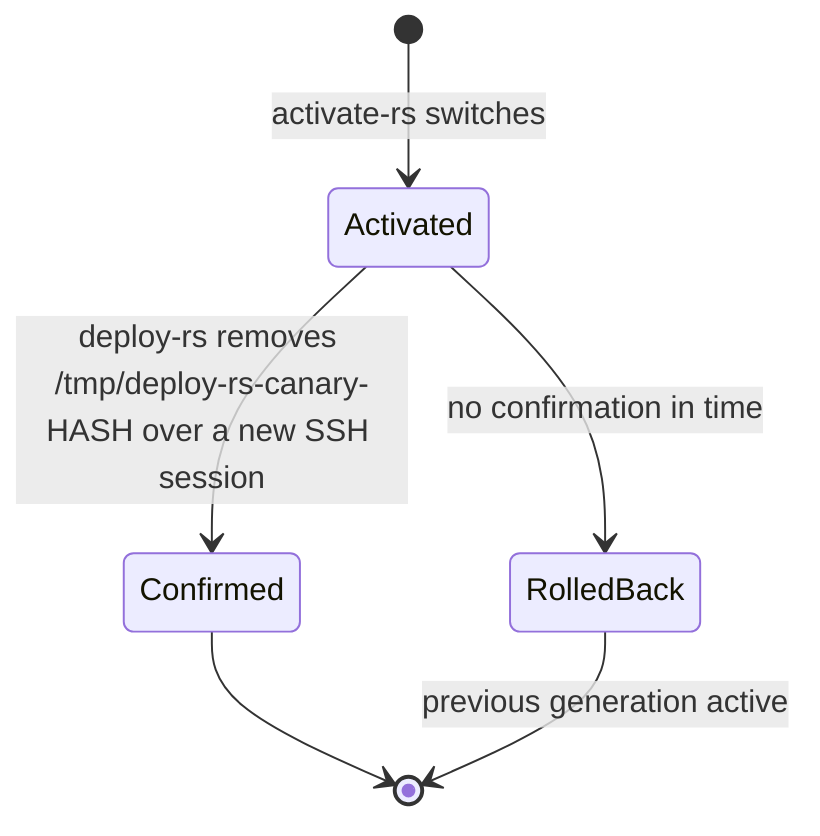
```mermaid
stateDiagram-v2
    [*] --> Activated: activate-rs switches
    Activated --> Confirmed: deploy-rs removes /tmp/deploy-rs-canary-HASH over a new SSH session
    Activated --> RolledBack: no confirmation in time
    Confirmed --> [*]
    RolledBack --> [*]: previous generation active
```

Sources: `modules/hosts/legion/default.nix` (the NOPASSWD canary rule).

### NetBird management

How does a declared NetBird change reach the management server?

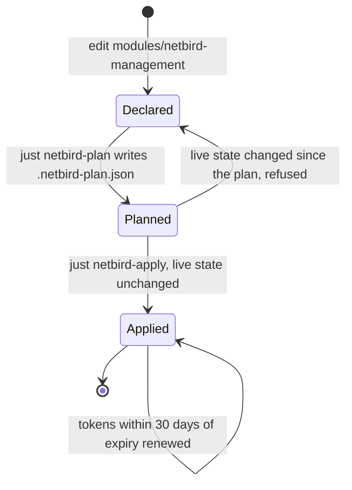
```mermaid
stateDiagram-v2
    [*] --> Declared: edit modules/netbird-management
    Declared --> Planned: just netbird-plan writes .netbird-plan.json
    Planned --> Applied: just netbird-apply, live state unchanged
    Planned --> Declared: live state changed since the plan, refused
    Applied --> Applied: tokens within 30 days of expiry renewed
    Applied --> [*]
```

Sources: `justfile`, `docs/runbooks/netbird.md`.

### CI push to garret

How does a `main` CI job push its builds?

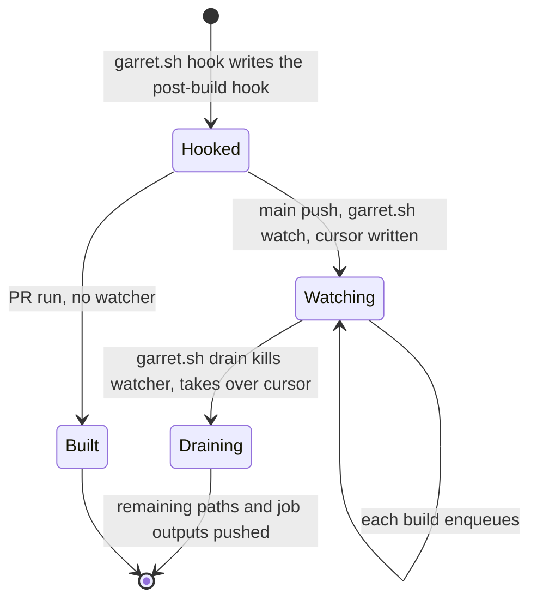
```mermaid
stateDiagram-v2
    [*] --> Hooked: garret.sh hook writes the post-build hook
    Hooked --> Built: PR run, no watcher
    Hooked --> Watching: main push, garret.sh watch, cursor written
    Watching --> Watching: each build enqueues
    Watching --> Draining: garret.sh drain kills watcher, takes over cursor
    Draining --> [*]: remaining paths and job outputs pushed
    Built --> [*]
```

Sources: `.ci/garret.sh`, `.github/workflows/ci.yml`.

### zakkart activation

How do the scripted macOS preferences converge?

```mermaid
stateDiagram-v2
    [*] --> Defaults: defaults writes, fail loudly
    Defaults --> Browser: default browser checked
    Browser --> Handlers: Helium already default
    Browser --> Handlers: set Helium, warn on failure
    Handlers --> Registered: lsregister the torrent shim
    Registered --> [*]: duti sets handlers, warn on failure
```

Sources: `modules/macos-defaults.nix`, `modules/torrent-shim/default.nix`.

### iCloud media import

How does one iCloud item reach atrium?

```mermaid
stateDiagram-v2
    [*] --> Placeholder: item in iCloud Drive
    Placeholder --> Staging: each file downloaded, rsync into .incoming, verified, evicted
    Staging --> Queued: whole item moved into import/
    Placeholder --> Placeholder: already in import/, skipped
    Queued --> Filed: atrium files it into the library
    Filed --> [*]
```

Sources: `modules/media/icloud-import.sh`. A second run after atrium files
an item imports it again; the check covers `import/` only.
